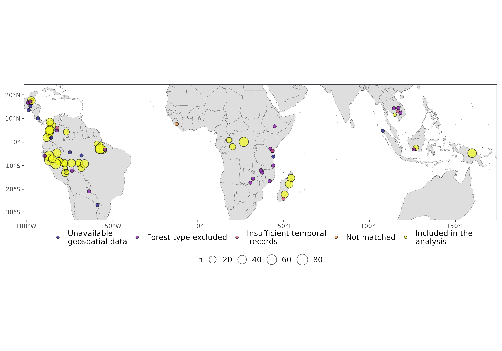
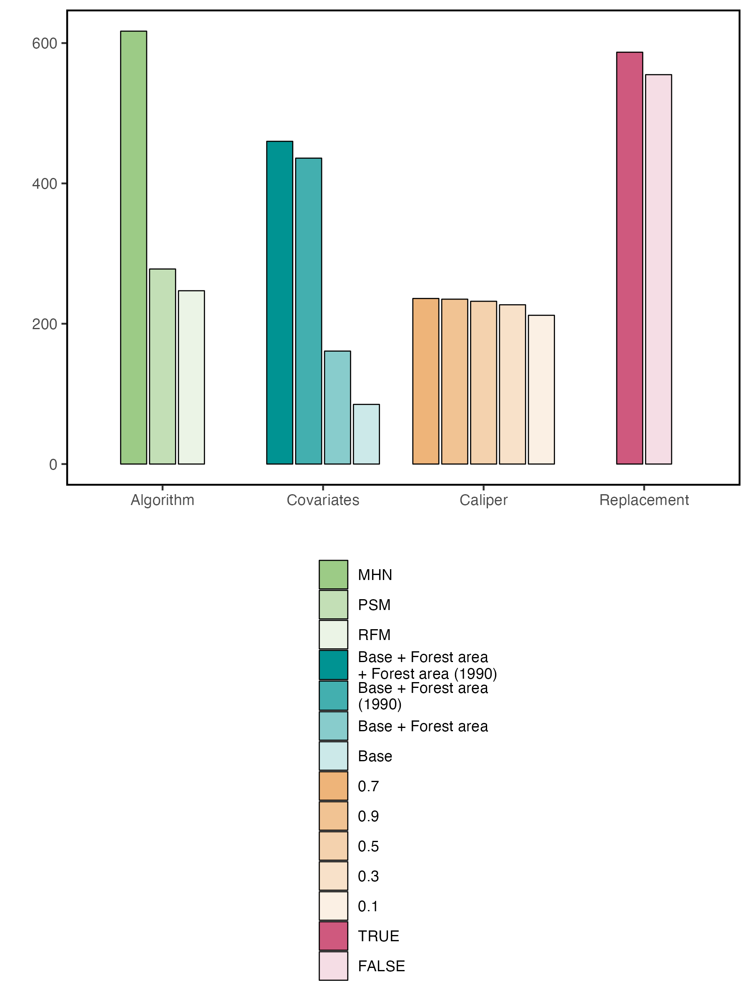
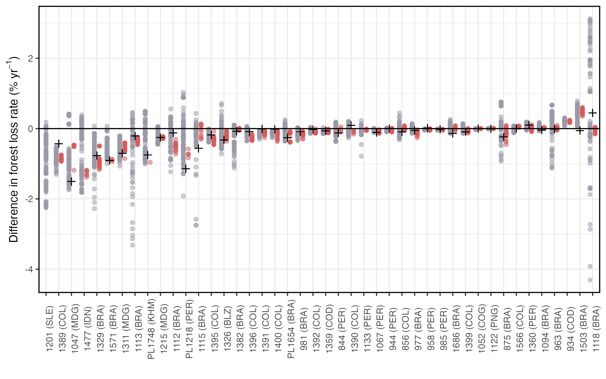
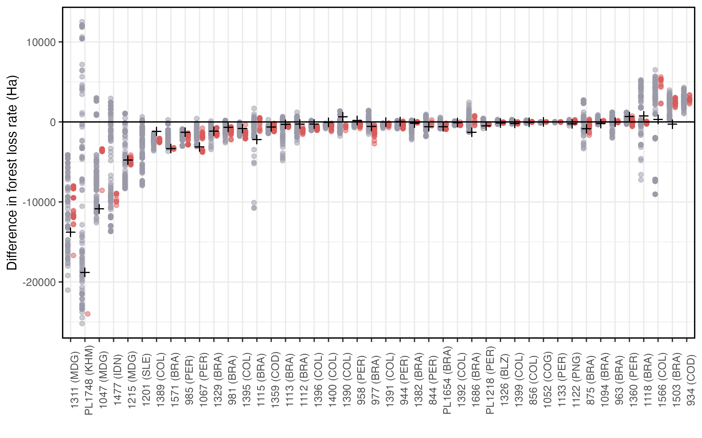
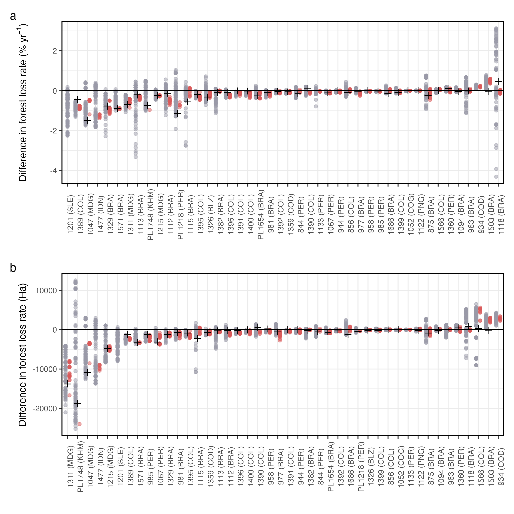

# Code to reproduce the main figures

```r
suppressPackageStartupMessages(library(tidyverse))
library(knitr)
library(magrittr)
library(broom)
library(boot)

pth = "~/redd-sens/" # <- point to the project folder stored in your local directory

# Load functions
source(paste0(pth,'code/funs.r'))
```

Load the relevant data sources

```r
d = read_csv(paste0(pth,"data/matched_sets_all.csv")) %>% filter(meets_int_cond==T)
d_guizar = read_csv(paste0(pth,"data/guizar_2022.csv"))
selected_runs = read_csv(paste0(pth,"data/selected_robust_runs.csv"))
redd_meta = read_csv(paste0(pth,"data/vcs-info.csv"))

inclusion_lab = c('Unavailable\ngeospatial data','Forest type excluded','Insufficient temporal\n records','Not matched','Included in the\nanalysis')

redd_meta$inclusion_status = factor(redd_meta$inclusion_status, levels=inclusion_lab)

# Define factors
cov_labs = c('Base', 'Base + Forest area', 'Base + Forest area\n(1990)', 'Base + Forest area\n+ Forest area (1990)')
algo_labs = c('MHN','PSM', 'RFM')

d$f.covariates = factor(d$f.covariates,levels=cov_labs,labels=cov_labs)
d$f.algorithm = factor(d$f.algorithm,levels=algo_labs,labels=algo_labs)
d$f.caliper = factor(d$f.caliper)
d$f.with_repl = factor(d$f.with_repl)

# subset of robust models
dd = d %>%  filter(is_valid==T & meets_int_cond==T)
```

## Fig 3

Count by inclusion stages

```r
redd_meta %>% group_by(inclusion_status) %>% tally() %>% kable()
```

|f.stage                       |  n|
|:-----------------------------|--:|
|Unavailable geospatial data    | 10|
|Forest type excluded          | 22|
|Insufficient temporal records |  5|
|Not matched                   |  1|
|Included in the analysis       | 43|


```r
library(rnaturalearth)
library(rnaturalearthdata)
library(sf)
theme_set(theme_bw())

## map
centroids = redd_meta %>% # filter( inclusion_status != inclusion_lab[1])  %>%
  left_join(dd %>% group_by(vcs_id) %>% tally()) %>%
  mutate(n = ifelse(is.na(n),1,n)) %>%
  st_as_sf(., coords = c("lon", "lat"), crs = 4326, agr = "constant") %>% rename(pt_4326 = geometry)

world <- ne_countries(scale = "medium", returnclass = "sf")
world = st_transform(world, crs = st_crs(4326))

library(countrycode)
redd_meta$iso3 = countrycode(redd_meta$country,origin = "country.name",destination = "iso3c")

# MAP
world.moll = st_transform(world, crs = "+proj=moll")
world.wintri = lwgeom::st_transform_proj(world, crs = "+proj=wintri")

roi = world.moll %>% filter(iso_a3 %in% unique(redd_meta$iso3))

bbox = sf::st_bbox(roi)
bbox['ymax'] = 3000000 

mp = ggplot() +
    geom_sf(data = world.moll, fill='#dedede', lwd=0.1) +
    geom_sf(data = st_transform(centroids, crs = "+proj=moll"),aes(fill=inclusion_status, size=n), shape=21, color='black',alpha=0.7, ) + scale_size(range = c(2, 7)) +
    coord_sf(xlim = c(bbox['xmin'], bbox['xmax']), ylim = c(bbox['ymin'], bbox['ymax']), expand = FALSE) +
    scale_fill_viridis_d(option = "plasma","") +
    theme_classic() +
    theme(panel.border = element_rect(fill='transparent', color='#23212A'),
          axis.line = element_blank(),
          legend.box = "vertical",
          legend.position = "bottom",
          legend.text = element_text(angle = 0, size=11),
          plot.margin = unit(c(0.1,0.1,0.1,0.1), "in"),
          legend.margin=margin(0.1,0.1,0.1,0.1),
          legend.box.spacing = unit(0.001, "in"))

# ggsave(filename=paste0(pth,'img/sites-map-moll.png'), plot=mp, width=10)
```



### Fig 4

```r
library(rcartocolor)
library(monochromeR)

ftcs=c('f.algorithm', 'f.covariates', 'f.caliper', 'f.with_repl')
base_col=carto_pal(7, "Temps")[c(3,1,5,7)]
names(base_col) =  ftcs

d_fact = data.frame()

for(e in ftcs) {
  # get counts by factor in each param
  d_tmp = dd %>% select(!!ensym(e)) %>% rename('param' = !!ensym(e)) %>% group_by(param) %>% tally() %>% arrange(desc(n))
  d_tmp$param = factor(d_tmp$param, levels=d_tmp$param)
  d_tmp$factor = e

  # now extract colours for each factor
  tmp_pal = generate_palette(base_col[e], modification = "go_lighter", n_colours = nrow(d_tmp), view_palette = F)
  d_tmp$col = tmp_pal

  d_fact %<>% bind_rows(d_tmp)
}

d_fact$factor = factor(d_fact$factor)
d_fact$factor = fct_relevel(d_fact$factor,ftcs)
d_fact$factor = factor(d_fact$factor,label= c('Algorithm', 'Covariates' ,'Caliper', 'Replacement'))
# d_fact$param = paste0(d_fact$factor,': ', d_fact$param)

ggp =  ggplot(d_fact, aes(factor,n, fill=param)) +
  geom_bar(stat='identity', color='black', position=position_dodge2(width=0.9, preserve = "single"),width=0.9, linewidth=0.3) +
  scale_fill_manual(values=d_fact$col) +
   guides(fill = guide_legend(ncol = 1)) +
  # geom_text(aes(label = n), vjust = -0.5, color = "black", size = 3, position = position_dodge(width = 0.9)) +
  theme_classic() +
  theme(
  panel.background = element_rect(fill = '#FFFFFF', color = NA),
  panel.border = element_rect( fill=NA, colour = "black", size=1),
  legend.position = "bottom",
  legend.title=element_blank(),
  axis.line = element_blank()) + xlab("") + ylab("")
  #   axis.text.x  = element_text(angle=45,hjust=0.95,vjust=0.2)

ggsave(paste0(pth,'img/','barchart-matching-factors.png'),ggp,width=6, height=8, units='in')
```



### Fig 5

Top panel (a): Avoided defor %

```r
# load meta data
d %<>% left_join(redd_meta %>% select(vcs_id,iso3,area_ha))

# load guizar
d_guizar %<>% mutate(guizar = 0-(rate_diff*100))
d %<>% left_join(d_guizar %>% select(vcs_id,guizar))

# re-arrange by %s
ord = d %>% select(vcs_id,DD_perc) %>% group_by(vcs_id) %>% summarise(DD_perc = mean(DD_perc)) %>% arrange(DD_perc) %>% .$vcs_id
d$vcs_id =  factor(d$vcs_id,levels=ord)
d %<>% mutate(lab_id = factor(paste0(vcs_id," (",iso3,")")))
d$lab_id = fct_reorder(d$lab_id,as.integer(d$vcs_id))

cols_ =c("#9a9aa7", "#da5a5a")

# Do the plotting
ggp_yr = d %>% ggplot(aes(lab_id,DD_perc,color=is_valid)) +
geom_point(alpha=0.5, position=position_dodge(width=0.8)) +
geom_point(aes(lab_id,guizar), color='black', shape=3, size=2) +
xlab("") +
ylab("Difference in forest loss rate (%"~yr^-1*')') +
theme_bw() +
geom_hline(yintercept=0) +
# scale_y_continuous(breaks = seq(-1.5,2,0.2)) +
scale_color_manual(values=cols_) +
theme(panel.border = element_rect( fill=NA, colour = "black", size=1),
legend.position = "none",
legend.title=element_blank(),
axis.line = element_blank(),
axis.text.x  = element_text(angle=90))

ggsave(paste0(pth,'img/','area-based-deforestation-loss-comparisons','.png'),ggp_yr, width=8, height=5, units='in')
```



Bottom panel (b): Avoided deforestation in HA


```r
d %<>% mutate(DD_ha = area_ha*(DD_perc*5)*0.01, guizar_ha = area_ha*(guizar*5)*0.01)

# re-arrange by HA
ord = d %>% select(vcs_id,DD_ha) %>% group_by(vcs_id) %>% summarise(DD_ha = mean(DD_ha)) %>% arrange(DD_ha) %>% .$vcs_id
d$vcs_id =  factor(d$vcs_id,levels=ord)
d %<>% mutate(lab_id = factor(paste0(vcs_id," (",iso3,")")))
d$lab_id = fct_reorder(d$lab_id,as.integer(d$vcs_id))

# Do the plotting
ggp_ha = d %>% ggplot(aes(lab_id,DD_ha,color=is_valid)) +
geom_point(alpha=0.5, position=position_dodge(width=0.8)) +
geom_point(aes(lab_id,guizar_ha), color='black', shape=3, size=2) +
xlab("") +
ylab("Difference in forest loss rate (Ha)") +
theme_bw() +
geom_hline(yintercept=0) +
# scale_y_continuous(breaks = seq(-1.5,2,0.2)) +
scale_color_manual(values=cols_) +
theme(panel.border = element_rect( fill=NA, colour = "black", size=1),
legend.position = "none",
legend.title=element_blank(),
axis.line = element_blank(),
axis.text.x  = element_text(angle=90))

ggsave(paste0(pth,'img/','area-based-deforestation-loss-comparisons-ha','.png'),ggp_ha, width=8, height=5, units='in')

```



```r
library(patchwork)
gg_out = (ggp_yr/ggp_ha) + plot_layout(guides = 'collect') +
plot_annotation(tag_levels = c('a')) &
theme(legend.position="none",legend.box.spacing = unit(0.001, "in"))

ggsave(filename=paste0(pth,'img/area-based-deforestation-panels','.png'), plot=gg_out, height=8, width=8, units='in', dpi=300)
```



## Bootstrapped effect sizes

- Starts by using all the available runs in `d` and filtering to only include rows that met matching quality criteria (`is_valid==T`).
- Results are condensed in the table `d_boots_perc`, which contains mean and bootstrapped CIs of effect sizes per project. These were computed using all the available valid models. We excludes sites `PL1748` and `1052` from the bootstrapping since the former had only one valid run and the latter had effect sizes of zero. However, their means are appended as single mean estimates to the summary table.
- To calculate a global effect size, we take the average of the project-level estimates reported in `d_boots_perc` and bootstrap to compute 95% CIs.

```r
exclude_vcs = c('PL1748','1052')

d_boots_perc = boot.summaries(
  meanD, mean,'DD_perc',
  d %>% filter(is_valid==T) %>% filter(!vcs_id %in% c(exclude_vcs)) %>% 
  group_by(vcs_id)) %>%  bind_rows(
  d %>% filter(is_valid==T)  %>% filter(vcs_id %in% exclude_vcs) %>% group_by(vcs_id) %>% summarise(n=n(), estimate=mean(DD_perc)))


d_boots_global_prop =
boot(data = d_boots_perc$estimate, statistic = meanD, R = 9999)
globa_ci = boot.ci(d_boots_global_prop,type = c("bca"))
glb_mean = mean(d_boots_perc$estimate)
glb_lw = globa_ci[[4]][4] 
glb_up = globa_ci[[4]][5]

print('Global effect size: ')
print(paste0('mean: ', round(glb_mean,2), ' CI: ', round(glb_lw,2), ' to ', round(glb_up,2)))
```
```
[1] "Global effect size: "
[1] "mean: -0.22 CI: -0.33 to -0.13"
```


## Correlations

```r
d_sum = d %>% filter(is_valid==T) %>% group_by(vcs_id) %>%  summarise(DD_perc=mean(DD_perc), DD_ha=mean(DD_ha))
# Write mean estimates
# d_sum %>% write_csv(paste0(pth,'data/mean_estimates_valid_matched_models.csv'))

d_guizar %<>% left_join(redd_meta %>% select(vcs_id,iso3,area_ha)) %>%
mutate(guizar_perc = 0-(rate_diff*100), guizar_ha = 0-(area_ha*(rate_diff*5)*0.01))

cor.test(
  ~ DD_perc + guizar_perc,
  data = d_sum %>%  na.omit())

cor.test(
  ~ DD_ha + guizar_ha,
  data = d_sum %>%  na.omit())
```

```
	Pearson's product-moment correlation

data:  DD_perc and guizar_perc
t = 6.441, df = 38, p-value = 1.417e-07
alternative hypothesis: true correlation is not equal to 0
95 percent confidence interval:
 0.5302768 0.8440127
sample estimates:
      cor 
0.7224478 


	Pearson's product-moment correlation

data:  DD_ha and guizar_ha
t = 13.05, df = 38, p-value = 1.29e-15
alternative hypothesis: true correlation is not equal to 0
95 percent confidence interval:
 0.8250979 0.9485398
sample estimates:
      cor 
0.9042036 

```
